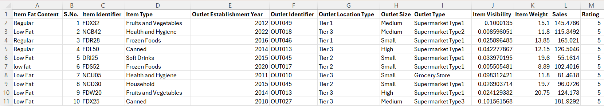
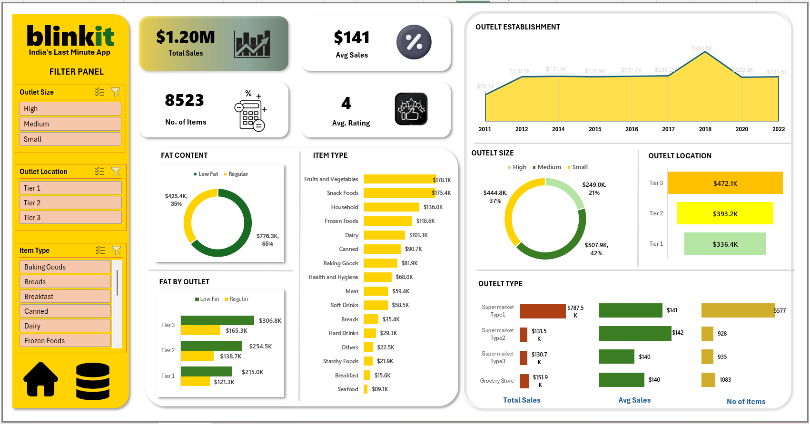

# Blinkit Sales Dashboard (Excel)

## Project Overview

Built an interactive sales dashboard in Excel to analyze Blinkit sales performance across products, outlet types, outlet sizes, and locations.

The dashboard provides business insights using pivot tables, pivot charts, KPI cards, and slicers for dynamic filtering.

## Dataset

The [dataset](https://docs.google.com/spreadsheets/d/1bKY8BXqaYwGrxBrJDp13jXndhVmIXxFh/edit?usp=sharing&ouid=103713302375895814079&rtpof=true&sd=true) contains 8,523 records.

## Data Cleaning

Performed data preprocessing in Excel using:
- Find & Replace for inconsistent values
- Handling missing/null values
- Replaced missing numerical values using Mean / Median
- Standardized categorical values

## Dashboard Features

#### KPI Cards
- Total Sales: $1.20M
- Average Sales: $141
- Number of Items: 8523
- Average Rating: 4

## Analysis Performed
- Total Sales by Fat Content
- Fat Content Sales by Outlet Location
- Total Sales by Item Type
- Sales by Outlet Establishment Year
- Sales by Outlet Size
- Sales by Outlet Location
- Outlet Type Analysis:
    - Total Sales
    - Average Sales
    - Number of Items

## Tools & Techniques Used
- Microsoft Excel
- Pivot Tables
- Pivot Charts
- Slicers
- KPI Cards
- Dashboard Design

Charts used:

- Bar Charts
- Donut Charts
- Area Chart

## Key Insights
- Low Fat products generated higher sales than Regular products.
- Fruits & Vegetables and Snack Foods contributed the highest sales.
- Tier 3 outlets had the highest overall sales.
- Medium-sized outlets generated maximum revenue.
- Supermarket Type 1 contributed the highest sales among outlet types.